# BlockTool

BlockTool is essentially a set of grasshopper scripts that performs simple geometric operations on lines drawn in Rhino 
to generate buildings. The geometrical operations follow a set of customisable rules. Additional functionality such as 
saving parameters, calculating built-up area, exporting csv and sketchup files have been added.
A set of useful(ish) error messages have also been added in to help users understand why the script is misbehaving.

The goal with this tool is to provide a basic template to build additional functionality and for new users of grasshopper
to see what is possible.

## Dependancies
External plugins are only used when necessary. A few of these features could replaced with native components or custom 
scripts, but why re-invent a slower wheel?

| Plugin           | Version      | URL                                 |
|------------------|--------------|-------------------------------------|
| Human            | 1.7.3.0      | [Human](https://www.food4rhino.com/en/app/human)|
| Sasquatch        | 1.0.0.0      | [Sasquatch Utilities](https://www.food4rhino.com/en/app/sasquatch-utilities)|
| EleFront         | 0.4.1.0      | [EleFront](https://www.food4rhino.com/en/app/elefront)|
| Pufferfish       | 3.0.0.0      | [Pufferfish](https://www.food4rhino.com/en/app/pufferfish?lang=en)|
| LunchBox         | 2016.3.21.0  | [LunchBox](https://www.food4rhino.com/en/app/lunchbox)|
| ShapeDiverSquid  | 1.7.0.0      | [Squid](https://www.food4rhino.com/en/app/squid)|

## Get Started
* Install dependencies from <code>[www.frood4rhino.com](www.frood4rhino.com)</code>
* Download the <code>demo</code> folder and the <code>src</code> folder from github
* Open the Rhino file inside <code>demo/3D Model/Demo_Site.3dm</code>
* Open the Grasshopper file <code>inside src/BlockTool_0.34.gh</code>  

FOR BUILDINGS  
* Ensure that the <code>IN</code> layer is the active layer
* Draw a curve in Rhino

FOR PARKING
* Ensure that the <code>PARKING</code> layer is the active layer
* Draw a curve in Rhino

## Open Block

## Closed Block

## Parking tool
The parking cluster is just another offset based parking script. 

Inputs  
A closed (preferable convex) curve in the PARKING layer.

In the script the cluster is hooked up to a galapagos component
to show how simple optimisation could be performed.

## Layer management
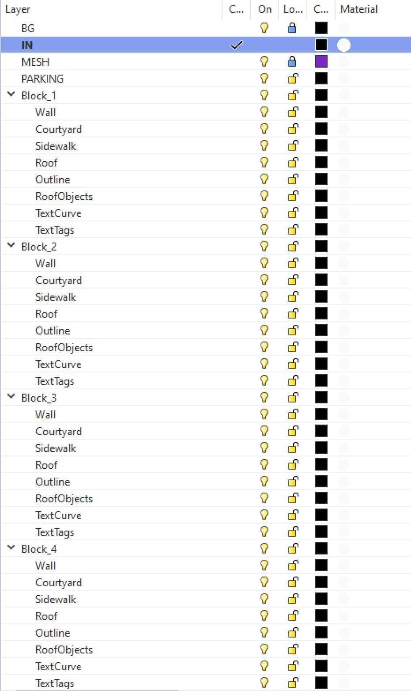
New layers are automatically created everytime a new curve is added to the project.
When save to rhino is clicked, the geometry is baked into these layers.
## Error reporting
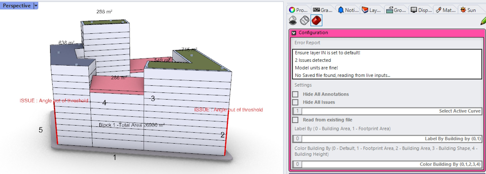
Some basic error reporting is done by the tool. It also reports whether the data is being read by the live inputs
or from a config file that was previously saved.

# User panel
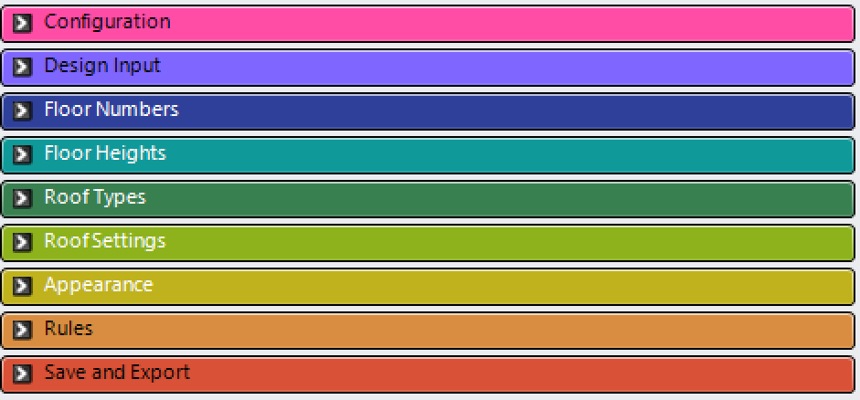
## Configuration
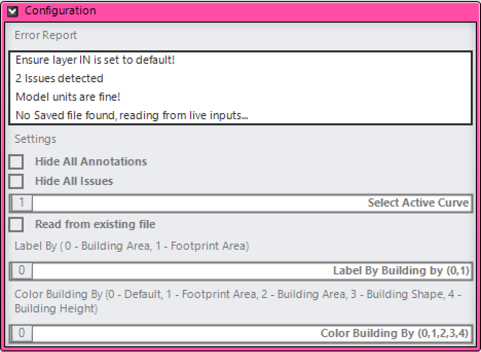

## Design Input

## Floor Numbers
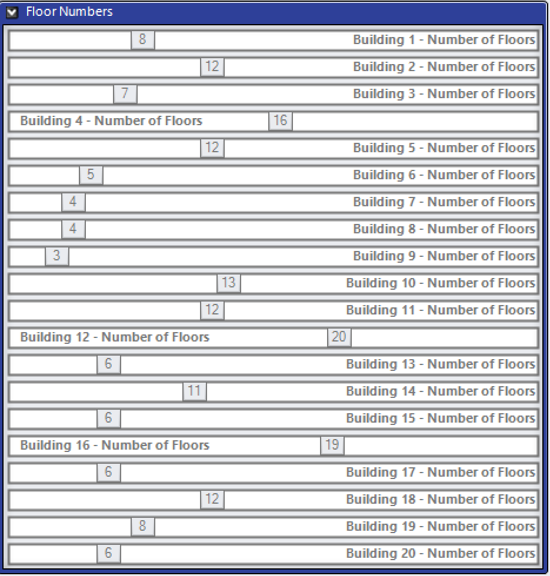

## Floor Heights
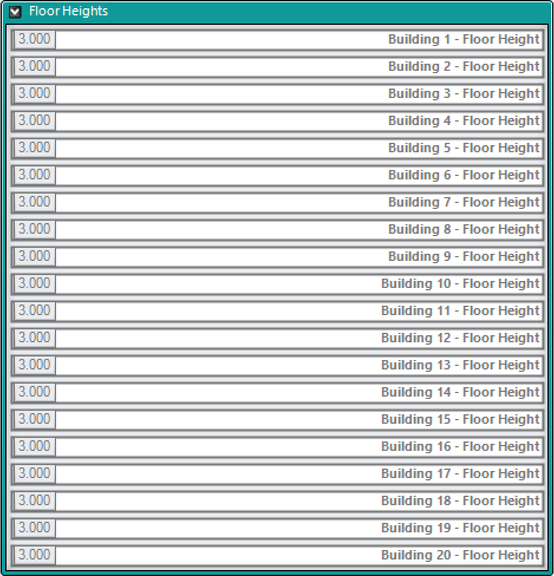
## Roof Types
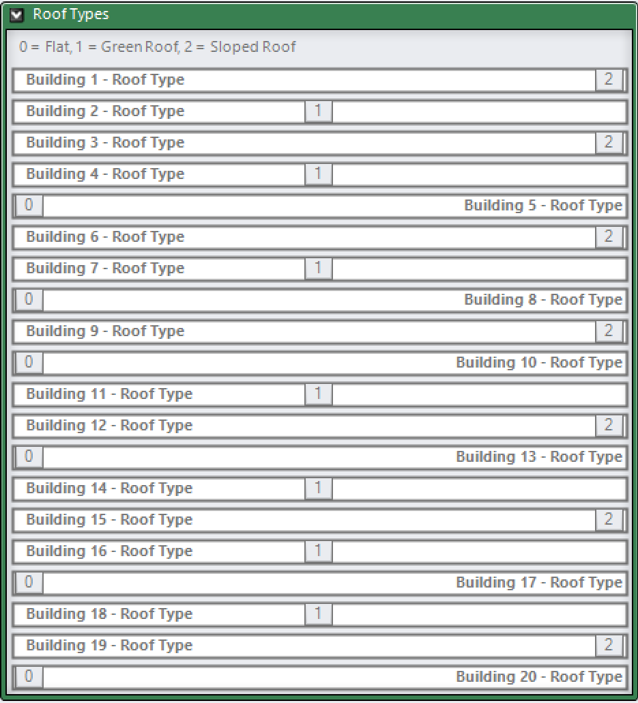
## Roof Settings
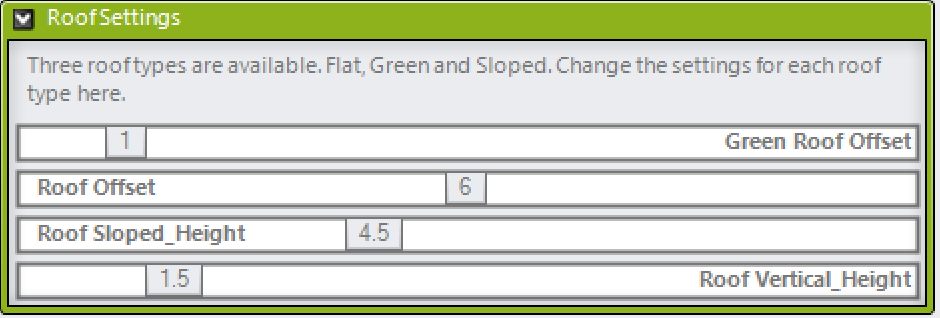
## Appearance
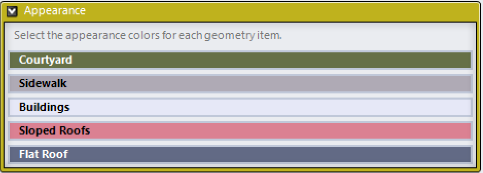
## Rules
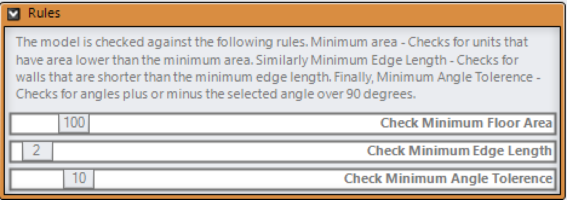
#Save and Export
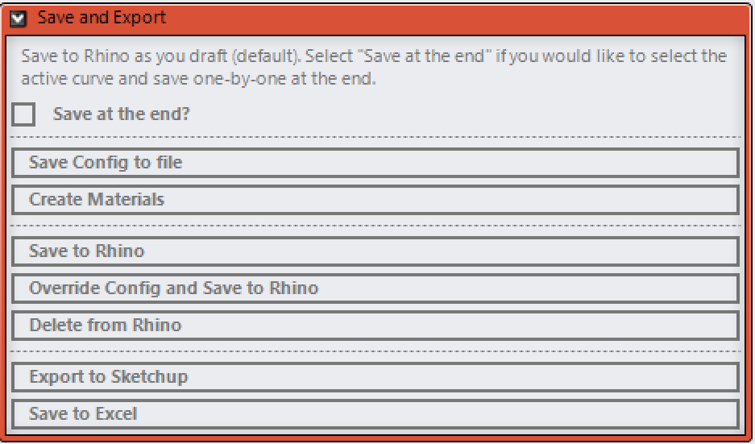
It is best to follow the order of the commands in this panel.  
* Save config to file - Saves a csv of the existing configurations and links it to the active curve.
This allows users to set custom values for each curve and then retrieve them by changing the active curve slider.  
* Create Materials - Creates rhino materials (only needs to be run once)  
* Save to Rhino - Bake
* Override Config and Save to Rhino - Overrides the confic csv and bakes geometry  
* Delete from Rhino - Safest way to clear geometry from Rhino. Delete breaks sometimes.  
* Export to sketchup - Exports baked geometry to a skp file  
* Save to excel - Saves a csv file of the block properties. Block number, number of units, bta of each unit is added to the csv.  

The project is developed by [Ossama Gabrallah](https://www.linkedin.com/in/ossama-gabrallah/) and [Sanjay Somanath](https://www.linkedin.com/in/snjsomanath/).
